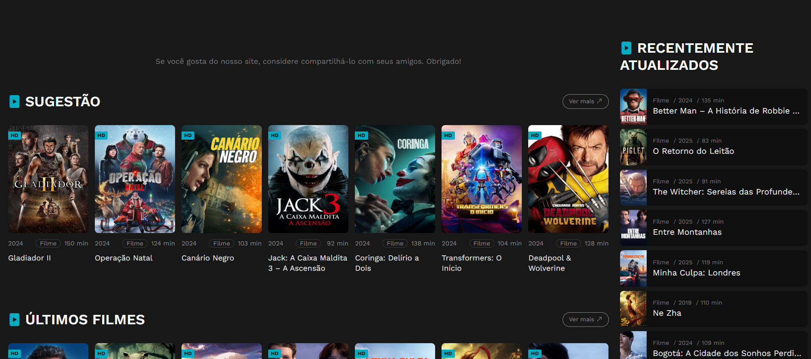

# Competitor Analysis: [PobreTV] 
## General Information 
- **Name of System:** PobreTV
- **Company/Developer:** -----
- **Website/Product Page:** [https://freeforyou.site/pobretv/] 
- **Version/Release Date:** 2021
- **Platform(s) Supported:** Web
- **Target Audience:** [pessoas que queiram ver filmes e séries sem pagar]

--- 
## Core Functionality 

**Primary Purpose:** [Poder pesquisar e assistir filmes e séries]

**Key Features:** - [pesquisa de filmes/séries] - [ver detalhes do silme/série (sinopse, avaliação)] - [adicionar aos favoritos e lista de favoritos] 

**Unique Selling Points (USPs):** - [conteudo gratuito, poder armazenar a uma lista de favoritos sem criar conta] 

**Limitations/Weaknesses:** - [lista de favoritos pouco visivel, botão de favoritos pequeno, sugestão pouco relevantes quando não há resultados] 

---

## Screenshots

> No inicio aparece mostanha russa com os filmes mais recentes, podesse ver barra de pesquisa com filtros em cima

> Já em vai ainda na 1a página html aparecem mais sugestões e últimos filmes e séries

> Quando selecionamos um filme podemos reparar na pequena opção de favoritos...

> No final da página pode se ver que da para voltar atras para filmes , séries ou ver a lista de favoritos (muito mal posicionado)

## Online Reviews
