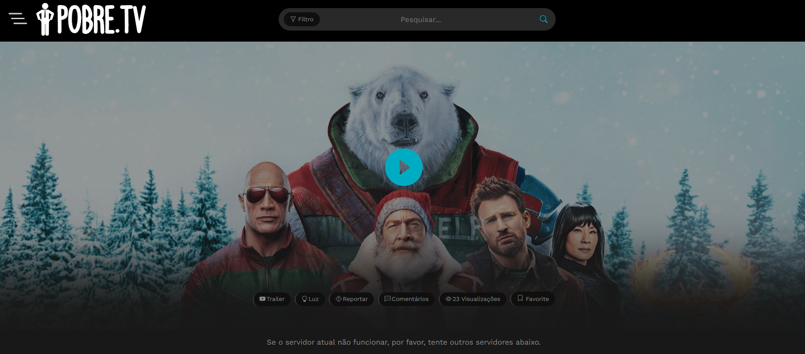
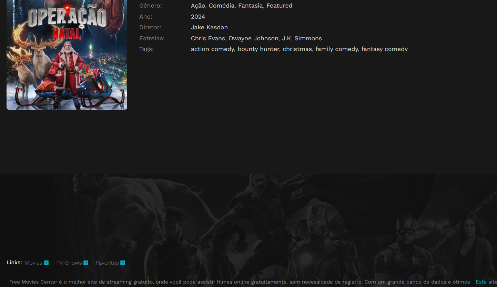

# Competitor Analysis: [PobreTV] 
## General Information 
- **Name of System:** PobreTV
- **Company/Developer:** -----
- **Website/Product Page:** [https://freeforyou.site/pobretv/] 
- **Version/Release Date:** 2021
- **Platform(s) Supported:** Web
- **Target Audience:** [pessoas que queiram ver filmes e séries sem pagar]

--- 
## Core Functionality 

**Primary Purpose:** [Poder pesquisar e assistir filmes e séries]

**Key Features:** - [pesquisa de filmes/séries] - [ver detalhes do silme/série (sinopse, avaliação)] - [adicionar aos favoritos e lista de favoritos] 

**Unique Selling Points (USPs):** - [conteudo gratuito, poder armazenar a uma lista de favoritos sem criar conta] 

**Limitations/Weaknesses:** - [lista de favoritos pouco visivel, botão de favoritos pequeno, sugestão pouco relevantes quando não há resultados] 

---

## Screenshots

> Ao acessar o site, a primeira coisa que se vê é uma seção em formato de "montanha-russa" destacando os filmes mais recentes. No topo da página, está disponível uma barra de pesquisa com filtros para facilitar a navegação pelos conteúdos.

> Ainda na primeira página, logo abaixo da seção inicial, aparecem sugestões adicionais de filmes e séries, incluindo os lançamentos mais recentes. Essa seção expande as opções disponíveis para o utilizador sem precisar de sair da página principal.

> Ao selecionar um filme, o utilizador é levado para a página com os detalhes desse título. Dentro dessa página, a opção para adicionar o filme aos favoritos está meio que pouco visível.

> No final da página, existe a possibilidade de voltar para a seção de filmes, séries ou acessar a lista de favoritos. No entanto, esta opção está posicionada de forma pouco intuitiva, tornando seu acesso pouco prático para o utilizador.

## Online Reviews
